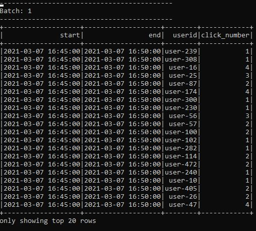

# SparkStream E-commerce Active Users in Last 5 minutes
### Dataflow Pipeline


### Summary

In this application we used 100.000 click data and simulate those data as 1 click each second using apache kafka and apache nifi. Apache nifi used to transform raw data and make it ready for analysis. SparkStream api used to perform necessary transformations. Results aggregated each 5 minutes and printed to consele for visualization. Spark's 5 minutes window function used to aggregate data in 5 minutes interval. Same data consumed by another kafka topic to send it to the MYSQL database through apache nifi for further query and reporting. Normally NOSQL database must be used for horizontal scaleability but in this project mysql has been chosen to demonstrate apache nifi-mysql server integration.

### Task List

- [x] Check raw json data using https://jsoneditoronline.org/


- [x] Create nifi pipeline


- [x] Create kafka topic
- [x] Create spark session and define schema
```
spark = SparkSession \
    .builder \
    .appName("Tumbling Window Stream Active Users") \
    .master("local[3]") \
    .config("spark.streaming.stopGracefullyOnShutdown", "true") \
    .config("spark.sql.shuffle.partitions", 2) \
    .getOrCreate()

#Describe schema (userid and productid will be enough to find most viewed category)
schema = StructType([
StructField("userid", StringType()),
StructField("timestamp", StringType())
])
```
- [x] Read data from kafka topic
```
#Read data from kafka topic
    kafka_df = spark.readStream \
        .format("kafka") \
        .option("kafka.bootstrap.servers", "localhost:9092") \
        .option("subscribe", "active") \
        .option("startingOffsets", "earliest") \
        .load()
```
- [x] Deserialization and transformations of data
```
#Data in kafka topic have key-value format, from_json is used to deserialize json value from string
    value_df = kafka_df.select(from_json(col("value").cast("string"), schema).alias("value"))
#Checking schema if everything is correct
    value_df.printSchema()
#Explode dataframe to remove sub-structures
    explode_df = value_df.selectExpr("value.userid", "value.timestamp")
#Checking schema if everything is correct
    explode_df.printSchema()
#Set timeParserPolicy=Legacy to parse timestamp in given format
    spark.sql("set spark.sql.legacy.timeParserPolicy=LEGACY")
#Convert string type to timestamp
    transformed_df = explode_df.select("userid", "timestamp") \
        .withColumn("timestamp", to_timestamp(col("timestamp"), "yyyy-MM-dd HH:mm:ss")) \

#Checcking schema if everything is correct
    transformed_df.printSchema()
```
- [x] Create 5 minutes window
```
#Create 5 min window
#Create watermark to autoclean history
#Groupby product_id and count considering distinct users
#Rename new column as count
    window_count_df = transformed_df \
        .withWatermark("timestamp", "5 minute") \
        .groupBy(col("userid"),
            window(col("timestamp"),"5 minute")).count()

    output_df = window_count_df.select("window.start", "window.end", "userid", "count") \
        .withColumn("click_number", col("count")) \
        .drop("count")
#Write spark stream to console or csv sink

    output_df.printSchema()
```

- [x] Create 2 foreach batch function to perform aggregations and write data into kafka topic and console
```
#Define foreach batch function to aggrate stream data several times and print console
def foreach_batch_func(df, epoch_id):
    df = df.sort(desc("click_number"))
    df \
        .write.format("console") \
        .save()
    pass

#Define foreach batch function to aggrate stream data several times and sink to csv file
def foreach_batch_func2(df, epoch_id):
    df = df.sort("click_number")
    #Prepare serialized kafka values
    kafka_df = df.select("*")
    #Choose columns
    kafka_df = kafka_df.selectExpr("*")

    kafka_target_df = kafka_df.selectExpr("userid as key",
                                                     "to_json(struct(*)) as value")
    kafka_target_df \
        .write \
        .format("kafka") \
        .option("header","true") \
        .option("kafka.bootstrap.servers", "localhost:9092") \
        .option("topic", "active2") \
        .save()
    pass
```
- [x] Write data into console and kafka topic
```
#Write spark stream to console or csv sink
    window_query = output_df.writeStream \
    .foreachBatch(lambda df, epoch_id: foreach_batch_func(df, epoch_id))\
    .outputMode("append") \
    .trigger(processingTime="5 minutes") \
    .start()

#Write spark stream to console or csv sink
    window_query_2 = output_df.writeStream \
    .foreachBatch(lambda df, epoch_id: foreach_batch_func2(df, epoch_id))\
    .outputMode("append") \
    .option("format","append") \
    .trigger(processingTime="5 minutes") \
    .start()

    window_query.awaitTermination()
```
- [x] Check the results to find most active users




- [x] Create mysql database and establish connection between mysql and apache nifi
- [x] Send data to mysql


### Code Description

Active_Users_Pipeline_v2.xml is nifi pipeline to simulate dataflow and perform ETL operations as well as sending data to mysql server.

nifi_spark_kafka_active_users_v2.py is spark streaming code for data processing, analysis and sink operation.


### Running

1. Start zookeeper (Check kafka scripts)

```
zookeeper-server-start.bat config\zookeeper.properties (zookeeper-server-start.sh for linux)
```

2. Start kafka (Check kafka scripts)
```
kafka-server-start.bat config\server.properties  (kafka-server-start.sh for linux)
```

3. Start nifi and processors

4. Execute below code

```
spark-submit --packages org.apache.spark:spark-sql-kafka-0-10_2.12:3.0.1 nifi_spark_kafka_active_users_v2.py
```
5. Start mysql server

6. Check results
